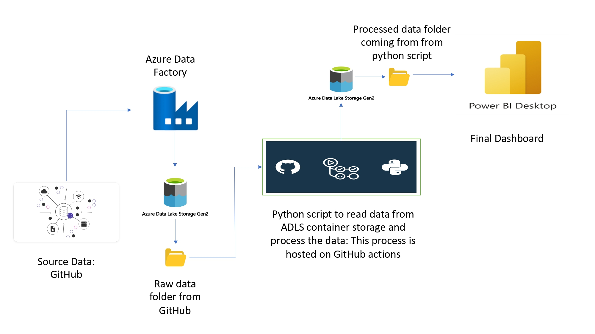

# azure-olympics
This repo is a data engineering tutorial implemented using Microsoft Azure cloud services and Python

# Architecture

📦 Data Ingestion: First, we leveraged Azure Data Factory to load data from a GitHub repository. Five essential files - teams.csv, medals.csv, athletes.csv, entries_gender.csv, and coaches.csv were retrieved.

🔒 User-Defined Variables: To ensure flexibility and security, I implemented a user input system. Users provide the container name, Azure Storage Account name, and Azure Storage Account access keys, allowing for seamless integration with different environments.

📂 Data Storage: The fetched data was then stored in Azure Data Lake Storage (ADLS) within a specified container and folder, keeping the data organized and accessible.

📋 Data Transformation: Using a Python script hosted on GitHub Actions, the magic happened. The five files were merged into one, creating a comprehensive dataset with enriched information.

📁 Data Processing: The consolidated data was stored in a dedicated folder called 'processedData' within the Azure container. This step prepares the data for the final presentation.

📊 Power BI Reporting: Last but not least, this processed data can be used for Power BI report using the processed data, providing an insightful visualization of the Tokyo Olympics data. This report is dynamic, allowing stakeholders to interact with the data.

# Implementation

python3 app.py -accnt_name "<Storage account name>" -accnt_key "<Storage account key>" -cont_name "<Container name>"

